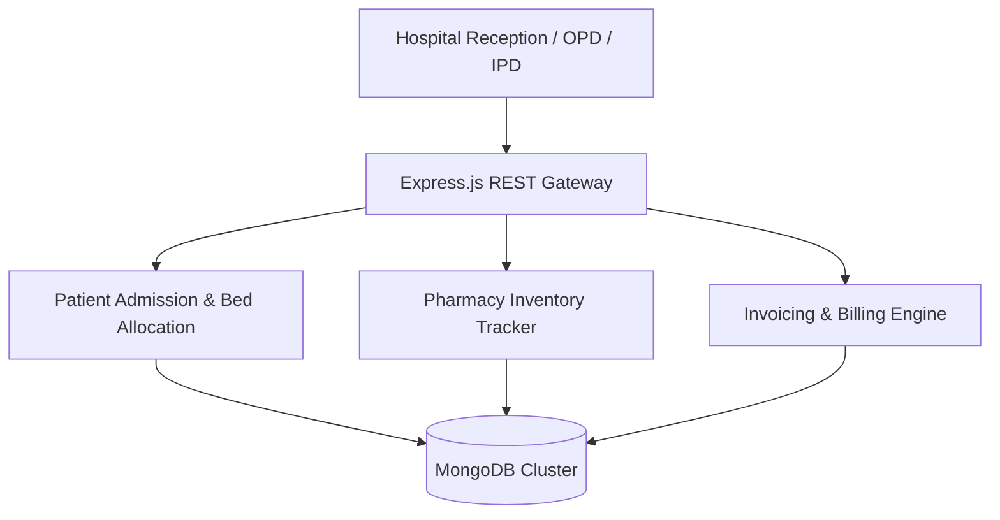

<div align="center">

# 🏥 Hospital & Clinical ERP Management System

<p align="center">
  <strong>Full-Featured Hospital Information System (HIS) for Inpatient & Outpatient Care</strong>
</p>

<p align="center">
      
</p>

<p align="center">
  <a href="#-overview">Overview</a> •
  <a href="#-system-architecture">Architecture</a> •
  <a href="#-key-features--capabilities">Key Features</a> •
  <a href="#-tech-stack--tools">Tech Stack</a> •
  <a href="#-quick-start">Quick Start</a> •
  <a href="#-author--license">Author</a>
</p>

</div>

---

## 📌 Overview

A hospital information ERP application designed to manage hospital workflows, outpatient (OPD) and inpatient (IPD) admissions, bed management, pharmacy inventory, and billing operations.

---

## 🏗️ System Architecture



---

## ✨ Key Features & Capabilities

- 🏥 **Patient Triage & Admission**: Bed allocation, OPD ticketing, and discharge summaries.
- 💊 **Pharmacy & Stock Control**: Real-time drug stock monitoring with automatic expiry alerts.
- 💳 **Itemized Medical Billing**: Invoice generation, laboratory charge tracking, and receipt printing.
- 👨‍⚕️ **Staff Scheduling**: Doctor on-call rotations and duty rosters.

---

## 🛠️ Tech Stack & Tools

- **JavaScript**
- **React.js**
- **Node.js**
- **Express.js**
- **MongoDB**
- **Material UI**

---

## 🚀 Quick Start

### 📋 Prerequisites
Ensure you have the required runtime environment installed:
* **Git** version 2.30+
* **Python 3.9+** / **Node.js 18+** / **Android Studio** (depending on project stack)

### 📥 Installation & Setup

```bash
# 1. Clone the repository
git clone https://github.com/muhammadokashapak/hospitala.git

# 2. Enter the directory
cd hospitala
```

---

## 👨‍💻 Author & License

<div align="center">

**Muhammad Okasha**
<br/>
*Deep Learning & Mobile Software Engineer*
<br/><br/>
<a href="https://github.com/muhammadokashapak"></a>
<a href="https://linkedin.com/in/muhammad-okasha"></a>
<a href="mailto:muhammadokashapak@gmail.com"></a>

<br/><br/>

*⭐️ If you find this project helpful, please consider giving it a star! • © 2026 [Muhammad Okasha](https://github.com/muhammadokashapak)*

</div>
